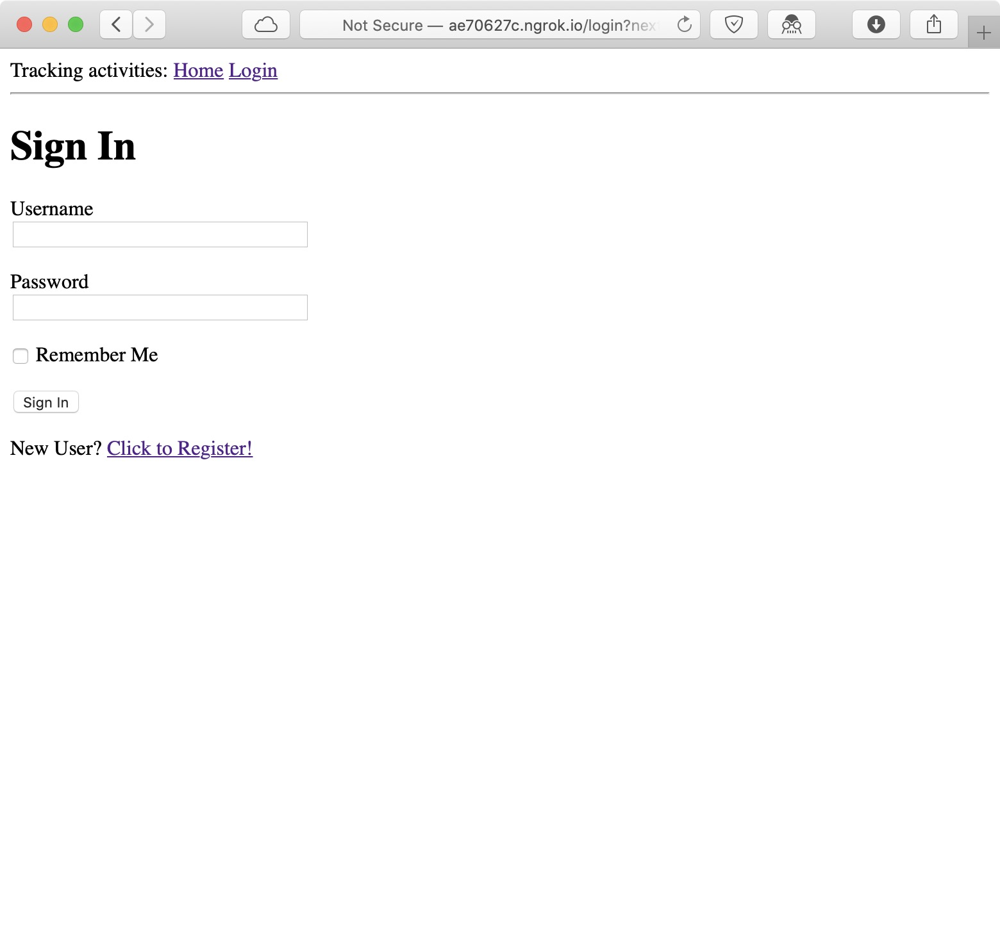
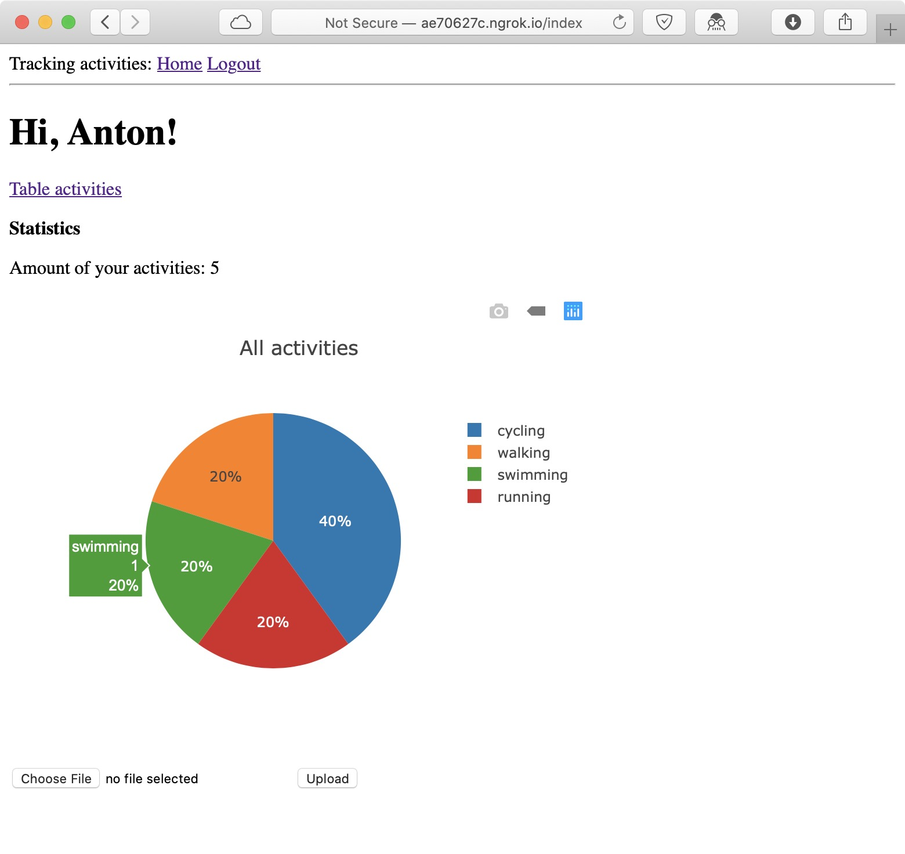
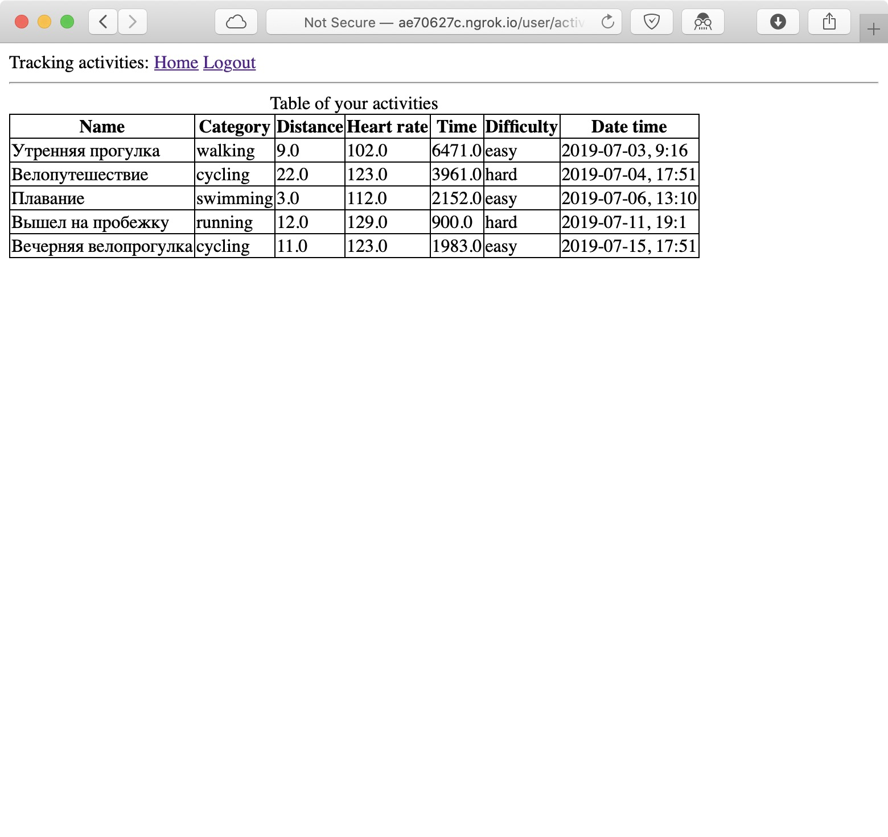

# TrackingActivities

## Web/Backend (Python + Flask)

| Экран логина | Статистика     | Данные таблицей |
| :-------------: | :-------------: | :-------------: |
|        |        |  |

## iOS App (Swift)

| Экран логина | Загрузка информации с сервера     | Список последних активностей |
| :-------------: | :-------------: | :-------------: |
|        |        |        |

| Подробная информация об активности (1) | Добавление активности в "Избранное" (1)    | Активность добавлена в "Избранное" (1)  |
| :-------------: | :-------------: | :-------------: |
|        |        |        |

| Добавление активности в "Избранное" (2) |  Две активности помечены как "избранные"    | Отображение только "избранных" активностей  |
| :-------------: | :-------------: | :-------------: |
|        |        | 
